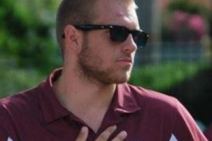

```{r setup, include=FALSE}
knitr::opts_chunk$set(echo = FALSE)
```

### Javiera Alarcon-Valenzuela, Undergraduate Exchange Student

{width=50mm}

Javiera conducted research in the Lab in 2013-2014 on the theme of the role of biodiversity in predicting Leptospira spp prevalence in the state of Georgia as part of an exchange program before returning to Ecuador to complete her BS Ecology.

### Laura Alexander

{width=50mm}

Laura Alexander, Research Assistant
Laura recently graduated from UGA in Ecology and Microbiology. She worked in the lab as a full-time research assistant helping out with various Ebola projects before she headed to Berkeley in the Fall of 2015 to work with Mike Boots.


### Brett Berry

{width=50mm}

Brett Berry, Master’s Student
Brett completed his Master’s degree, in which he studied the effects of a bacterial parasite on endangered Elkhorn coral in Florida.


### Chris Cleveland

{width=50mm}

Chris Cleveland, Master’s Student
Chris recently finished his masters degree in population health, under the advisement of Danny Mead and Andrew. He researched how metacommunity ecology links environmental drivers to Culicoides communities and hemorrhagic disease reports in the Southeastern United States. He went on to pursue a PhD under the advisement of Michael Yabsley at UGA.

### Chris Dibble

{width=50mm}

Chris Dibble, Postdoctoral Associate
Chris worked as a postdoctoral associate jointly with John Drake and Andrew on exploiting critical slowing down to provide early warning on the emergence of infectious diseases.


### Ash Griffin

{width=50mm}

Ash Griffin, PhD Student
Ash completed his PhD researching the spatial spread of white pox disease in Elkhorn coral populations, and currently holds a data science position at MailChimp.


### James Haven

{width=50mm}

James Haven, Postdoctoral Associate
James researched the evolutionary ecology of host-parasite interactions in the lab, including the role of superinfection in virulence evolution and the evolution of parasite life history traits driven by vector phenology-host immunology interactions. He is now advancing his career in health informatics.


### Jenna Lea

{width=50mm}

Jenna Lea, Undergraduate Student
Jenna was an undergraduate CURO fellow (Spring and Summer 2017). Her main research interests are in disease ecology, ticks and their pathogens and understanding patterns of tick diversity across the mammalian phylogeny.


### Krisztian Majori

{width=50mm}

Krisztian Magori, Postdoctoral Associate
Krisztian is a quantitative disease ecologist who worked as a postdoc in the lab. He coordinated much of the epizootic hemorrhagic disease research, and developed methods to detect the rates at which pathogens jump the species barrier and the mechanisms behind such cross-species transmissions, based solely on pathogen sequence data. He also worked on eco-evolutionary feedback processes involved in pathogen escape from treatment effects such as imperfect vaccines. Krisztian now holds a faculty position at Eastern Washington University.


### Kamran Mohammad

{width=50mm}

Kamran Mohammad, Undergraduate Student
Kamran worked in the lab while a senior undergraduate majoring in Mass Media Arts, with a minor in Biology. Kamran was credited with completing two research projects: one relating age structure and infection history to the epidemiology of influenza and the other on the emergence of drug resistance in macroparasites.


### Suzanne O’Regan, Postdoctoral Associate

{width=50mm}

Suzanne is a mathematical biologist with interests in dynamical systems and infectious disease dynamics. She researched disease-diversity relationships using modeling approaches and moved on to an independent postdoctoral associate position at NIMBIOS.

 


### Amanda Perofsky

{width=50mm}

Amanda Perofsky, Research Assistant
Amanda graduated with a double major in Ecology and Biology before joining the lab for 6 months as a Research Assistant. Amanda put together a large database on morbidity and mortality patterns in deer populations arising from a set of hemorrhagic disease viruses. She then did preliminary statistical analysis of these data in relation to land cover patterns. Amanda moved on from her position in the lab to pursue a PhD in Biology at the University of Texas, Austin with Lauren Ancel Meyers.


### John Roquet

{width=50mm}

John Roquet, Undergraduate Student
John was an undergraduate CURO research student who worked in the lab applying statistical modeling techniques to infectious disease problems.


### Scott Saunders

{width=50mm}

Scott Saunders, Undergraduate Student
Scott researched the effects of climate change on the predicted distribution of various strains of the causitive agent of Lyme disease. He used climate change models to establish the projected differences in summer and winter temperatures in regions of the US and then included this in a mathematical model. Scott is now a gradudate student at Cal Tech.


### Brad White

{width=50mm}

Brad White, Undergraduate Student
Brad worked on the spread of epizootic hemorrhagic disease, an arbovirus affecting white-tailed deer in the US. He examined a set of environmental and temporal variables to explain and predict the disease’s population dynamics using computer modeling.
