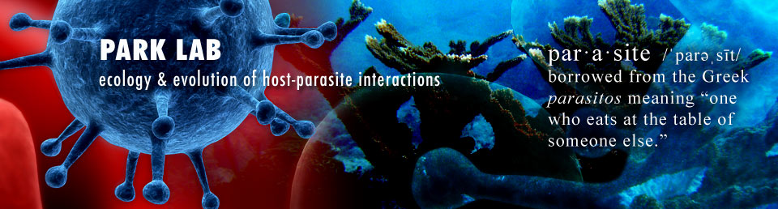

```{r setup, include=FALSE}
knitr::opts_chunk$set(echo = FALSE)
```

{width=500}

We're fascinated by how parasites interact with their hosts and the environment, and based in the Odum School of Ecology at the University of Georgia, we study host-parasite interactions within hosts, in populations and communities, and comparatively at the macroecology scale. 