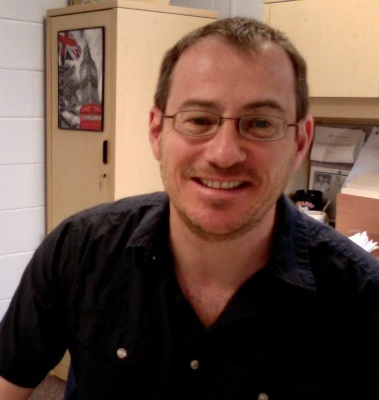
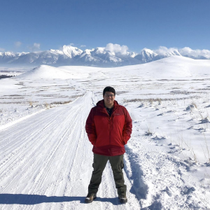
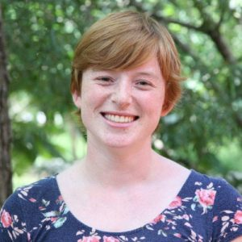
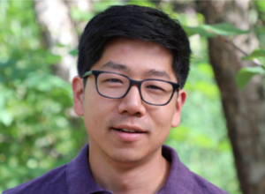
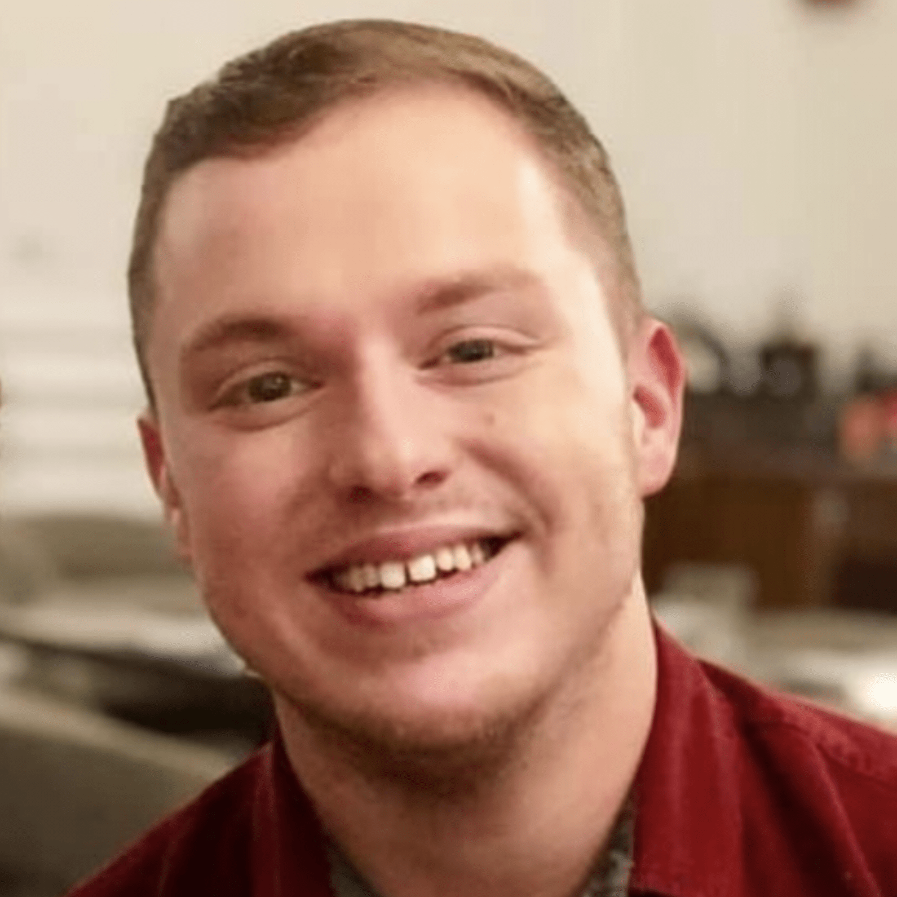

```{r setup, include=FALSE}
knitr::opts_chunk$set(echo = FALSE)
```

### Andrew Park (PI)

{width=50mm}

"I am an associate professor who develops theory to explain and predict population and evolutionary biology of host-parasite interactions"


### David Vasquez

{width=50mm}

"I am a PhD student in Ecology and a trainee in the IDEAS program researching how ecological and environmental conditions can affect the fitness and geographic range of parasites"


### Annakate Schatz

{width=50mm}

"I am broadly interested in spatial modeling, model evaluation, and species’ range dynamics. For my PhD research, I am investigating how hosts’ parasite communities change between native and non-native ranges, across terrestrial mammals."


### Daniel Suh

{width=50mm}

"I am broadly interested in spatial modeling, model evaluation, and species’ range dynamics. For my PhD research, I am investigating how hosts’ parasite communities change between native and non-native ranges, across terrestrial mammals."


### TJ Odom

{width=50mm}

"TJ joined the lab this fall."

